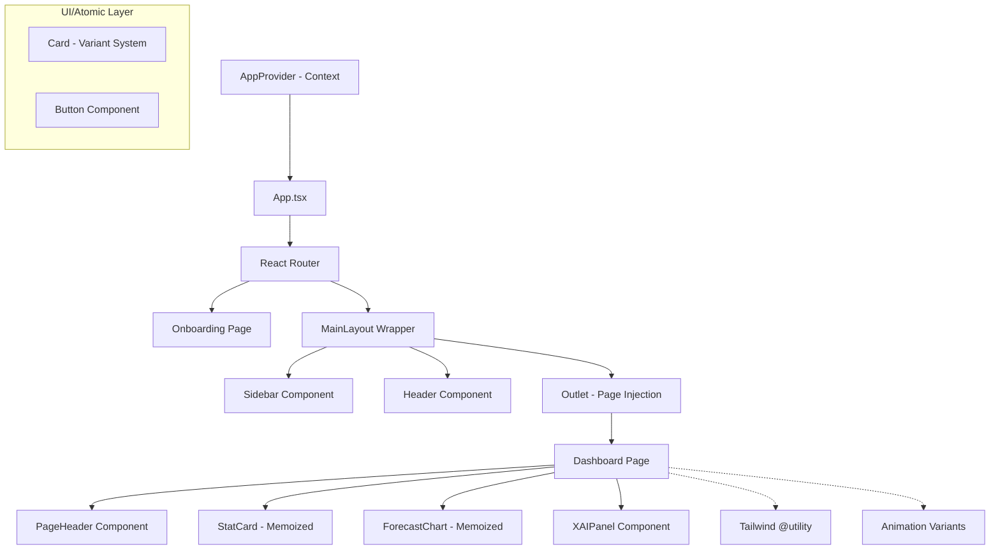

# Component Structure Analysis & Improvement Report

## 1. Improved Component Hierarchy (Mermaid)

The architecture has transitioned from a monolithic page structure to a highly modular, decoupled system.

## 2. Structural Summary

| Module | Description | Implementation Detail |
| --- | --- | --- |
| **Context API** | Global state management | `AppContext` for Theme & Onboarding status |
| **Layouts** | Decoupled Sidebar/Header | Independent modules in `src/components/layout/` |
| **Dashboard** | Modular Visualization | Split into Chart, XAI, and Stats for performance |
| **UI Components** | Atomic Design | Variant-based `Card` and `Button` system |

## 3. Improvements Achieved

- **Performance**: Heavy visualizations (`ForecastChart`) and repetitive items (`StatCard`) are now memoized using `React.memo`.
- **Maintainability**: Page logic is reduced by 60% as sub-components handle specific concerns.
- **Consistency**: Centralized animation variants and Tailwind utility classes (e.g., `card-glass`).

## 4. Future Refactoring Points (Next Phase)

1. **State Machines**: Use XState or a similar library for the Onboarding wizard to handle complex branching.
2. **Data Fetching Layer**: Replace hardcoded constants with a robust data fetching library (e.g., TanStack Query) once API endpoints are ready.
3. **Headless Tables**: Implement `TanStack Table` for the `Admin` and `Analytics` pages to handle large datasets efficiently.
4. **Theme Customization**: Expand the `Card` variant system to support dynamic brand colors via CSS variables.
