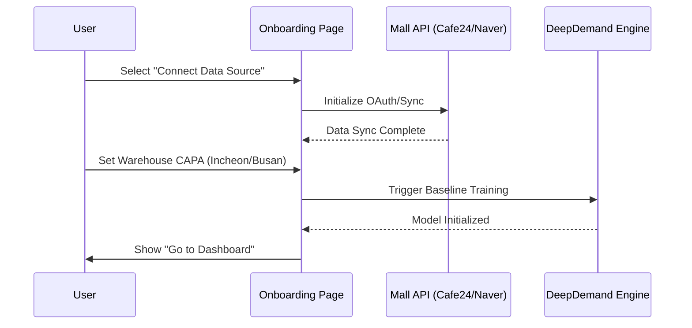
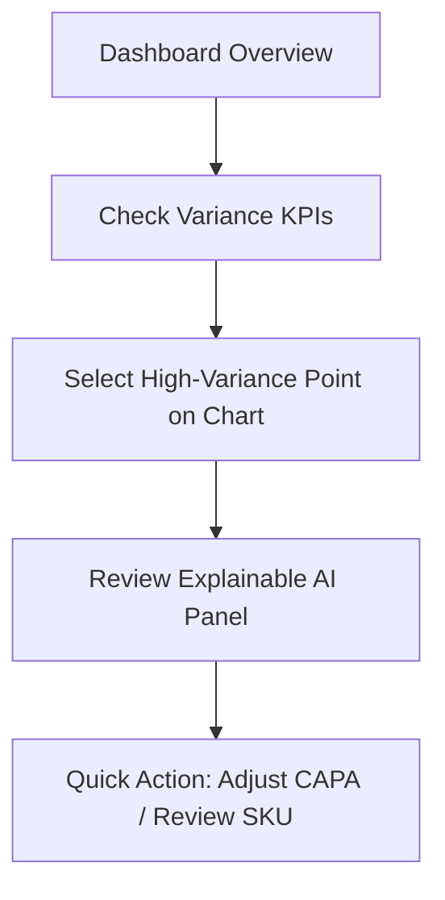

# UX Core Scenarios: DeepDemand

This document outlines the primary user journeys and interaction flows within the DeepDemand platform.

## 1. Onboarding & Baseline Configuration
**Goal**: New user sets up their AI forecasting model by connecting data sources and defining constraints.

### Key Interactions:
- **Progressive Disclosure**: Three-step wizard to prevent cognitive overload.
- **Visual Feedback**: Real-time progress bar during AI training phase.

## 2. Executive Demand Analysis
**Goal**: Analyst reviews the forecast, identifies variances, and understands the "Why" behind AI predictions.

### Key Interactions:
- **Interactive Charting**: Clicking data points on the Recharts graph triggers contextual AI insights.
- **Explainable AI (XAI)**: Breakdown of factors (Promotion, Weather, Stockout Risk) in a visual progress bar format.

## 3. Team Collaboration Flow
**Goal**: Planners and Warehouse Leads annotate forecasts to align physical operations with AI predictions.

- **Action**: User reads "Team Memos" on the dashboard.
- **Context**: "AI prediction for SKU-A seems high due to upcoming holiday."
- **Outcome**: Operational adjustment via "Quick Actions".
