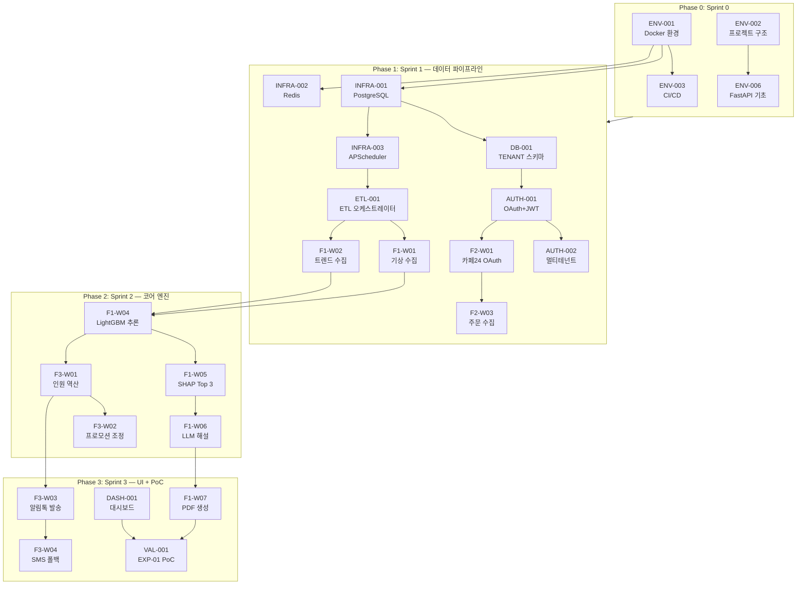

# TASK 목록 명세서 — SRS V1.0 기반

**Document ID:** TASKS-V1.0  
**Source:** SRS-V1.0 (2026-04-20)  
**작성 기준:** 보완된 6-Step 추출 프로세스 (Data-first, CQRS, AC→Test 변환)  
**Phase 기준:** PRD §8-1 로드맵 (Phase 0: Sprint 0, Phase 1~3: Sprint 1~3, 각 4주)  

---

## 추출 방법론

| Step | 추출 영역 | SRS 참조 섹션 | Task 수 |
|---|---|---|---|
| **Step 0** | 개발 환경 및 인프라 부트스트랩 | §1.5.3 C-TEC, §4.2.6 REQ-NF-029 | 6 |
| **Step 1** | 데이터 스키마 + API 계약 + 어댑터 + Mock | §6.1, §6.2, §3.1, §3.3 | 37 |
| **Step 2** | 기능 로직 Read/Write 분리 (CQRS) | §4.1 REQ-FUNC-001~028 | 33 |
| **Step 3** | AC → 테스트 Task 변환 | §5.1~§5.2 TC-001~TC-028 | 31 |
| **Step 4** | NFR/보안/모니터링/Fallback/UI/KPI | §4.2 REQ-NF-001~039, §6.4 | 39 |
| **총계** | | | **146** |

---

## Phase 요약

| Phase | 기간 | 핵심 목표 (PRD §8-1) | Task 수 | 비고 |
|---|---|---|---|---|
| **Phase 0** | Sprint 0 (1주) | 개발 환경 표준화, 프로젝트 구조 확립 | 6 | 선행 필수 |
| **Phase 1** | Sprint 1 (4주) | 데이터 파이프라인 통합, DB/API 계약, 외부 연동 | 62 | F2 완료 포함 |
| **Phase 2** | Sprint 2 (4주) | 코어 엔진(예측/XAI/인원역산), 모니터링 기초 | 38 | F1 코어 + F3 뼈대 |
| **Phase 3** | Sprint 3 (4주) | UI 프론트엔드, PDF, 알림, PoC 검증 | 40 | F1/F3 완성 + 파일럿 |

---

## Step 0 — 개발 환경 및 인프라 부트스트랩

> SRS §1.5.3 C-TEC-010, 013, 014 및 §4.2.6 REQ-NF-029 기반. 모든 개발의 기반이 되는 환경을 확립한다.

| Task ID | Phase | Epic | Type | Feature | 관련 REQ ID | Dependencies | 우선순위 | 복잡도 |
|---|---|---|---|---|---|---|---|---|
| ENV-001 | 0 | Environment | Infra | Docker + docker-compose 개발 환경 표준화 (PG, Redis, FastAPI 컨테이너 구성) | C-TEC-013 | None | Must | M |
| ENV-002 | 0 | Environment | Infra | 프로젝트 디렉토리 구조 설계 — 헥사고날 아키텍처 모듈 경계 (도메인/어댑터/포트 분리) | REQ-NF-029 | None | Must | M |
| ENV-003 | 0 | Environment | Infra | CI/CD 파이프라인 구성 (Git Push → Railway/Render 자동 배포) | C-TEC-010 | ENV-001 | Must | M |
| ENV-004 | 0 | Environment | Infra | Python 의존성 관리 (pyproject.toml) 및 린터/포매터 설정 (ruff, black) | C-TEC 전체 | ENV-001 | Must | L |
| ENV-005 | 0 | Environment | Infra | 환경 변수 관리 체계 (.env, secrets) + Pydantic Settings 모듈 구현 | C-TEC-009 | ENV-001 | Must | L |
| ENV-006 | 0 | Environment | Infra | FastAPI 애플리케이션 기본 구조 세팅 (라우터, 미들웨어, 에러핸들러, OpenAPI 자동 문서) | C-TEC-002 | ENV-002 | Must | M |

---

## Step 1 — 데이터 스키마 + API 계약 + 어댑터 + Mock

### 1-1. 데이터베이스 스키마 (§6.2 ERD 기반)

> 모든 엔터티의 SQLModel 모델 + Alembic 마이그레이션 스크립트. tenant_id 기반 Row-Level Isolation 포함.

| Task ID | Phase | Epic | Type | Feature | 관련 REQ ID | Dependencies | 우선순위 | 복잡도 |
|---|---|---|---|---|---|---|---|---|
| DB-001 | 1 | Data Model | DB | TENANT 테이블 스키마 + SQLModel 모델 + Alembic 마이그레이션 | §6.2 ERD | ENV-001, ENV-006 | Must | L |
| DB-002 | 1 | Data Model | DB | SHOP 테이블 스키마 (platform, oauth_token, refresh_token, status, last_sync) | §6.2 ERD | DB-001 | Must | L |
| DB-003 | 1 | Data Model | DB | ORDER + ORDER_ITEM 테이블 스키마 (is_promotion 플래그 포함) | §6.2 ERD | DB-002 | Must | M |
| DB-004 | 1 | Data Model | DB | PRODUCT + INVENTORY 테이블 스키마 (current_qty, safety_stock) | §6.2 ERD | DB-002 | Must | L |
| DB-005 | 1 | Data Model | DB | WEATHER_DATA 테이블 스키마 (region, temperature, precipitation, alert_level) | §6.2 ERD | DB-001 | Must | L |
| DB-006 | 1 | Data Model | DB | TREND_DATA 테이블 스키마 (keyword, search_volume, source) | §6.2 ERD | DB-001 | Must | L |
| DB-007 | 1 | Data Model | DB | FORECAST + FORECAST_FACTOR 테이블 스키마 (confidence_level, shap_value, explanation_text) | §6.2 ERD | DB-001 | Must | M |
| DB-008 | 1 | Data Model | DB | REPORT 테이블 스키마 (type, file_path, status, generated_at) | §6.2 ERD | DB-007 | Must | L |
| DB-009 | 1 | Data Model | DB | WORKFORCE_PLAN 테이블 스키마 (predicted_shipments, recommended_workers, notification_channel, notified_at) | §6.2 ERD | DB-001 | Must | L |
| DB-010 | 1 | Data Model | DB | AUDIT_LOG 테이블 스키마 (user_id, action, resource_type, resource_id, metadata JSONB) | §6.2 ERD | DB-001 | Must | L |
| DB-011 | 1 | Data Model | DB | tenant_id 기반 Row-Level Isolation — SQLModel 쿼리 필터 및 API 미들웨어 자동 적용 | REQ-FUNC-026 | DB-001 | Must | H |

### 1-2. 내부 API 계약 (§6.1 API Endpoint List 기반)

> 각 API의 Request/Response Pydantic DTO, 에러 코드 정의, OpenAPI 스키마 확정.

| Task ID | Phase | Epic | Type | Feature | 관련 REQ ID | Dependencies | 우선순위 | 복잡도 |
|---|---|---|---|---|---|---|---|---|
| API-001 | 1 | API Contract | API Spec | 예측 엔진 API (`POST /api/v1/forecast`) — Request DTO (tenant_id, target_date, sku_ids[]), Response DTO (forecasts[], confidence_level), 에러 코드 | API-INT-01 | DB-007 | Must | M |
| API-002 | 1 | API Contract | API Spec | PDF 리포트 생성 API (`POST /api/v1/report/generate`) — DTO (tenant_id, forecast_id, template_id → report_id, status, download_url) | API-INT-02 | DB-008 | Must | M |
| API-003 | 1 | API Contract | API Spec | 리포트 상태 조회 API (`GET /api/v1/report/{report_id}`) — Response DTO (report_id, type, status, generated_at) | API-INT-03 | DB-008 | Must | L |
| API-004 | 1 | API Contract | API Spec | 쇼핑몰 연동 시작 API (`POST /api/v1/integration/shop`) — DTO (platform, redirect_url → auth_url) | API-INT-04 | DB-002 | Must | M |
| API-005 | 1 | API Contract | API Spec | 쇼핑몰 OAuth 콜백 API (`POST /api/v1/integration/shop/callback`) — DTO (code, state → shop_id, platform, status) | API-INT-05 | DB-002 | Must | M |
| API-006 | 1 | API Contract | API Spec | 연동 상태 조회 API (`GET /api/v1/integration/shop/{shop_id}/status`) — DTO (shop_id, platform, status, last_sync) | API-INT-06 | DB-002 | Must | L |
| API-007 | 1 | API Contract | API Spec | 인원 역산 API (`POST /api/v1/workforce/calculate`) — DTO (tenant_id, center_id, target_date → predicted_shipments, recommended_workers) | API-INT-07 | DB-009 | Must | M |
| API-008 | 1 | API Contract | API Spec | 알림 발송 API (`POST /api/v1/notification/send`) — DTO (recipients[], template_id, variables → notification_id, channel, status) | API-INT-08 | None | Must | L |
| API-009 | 1 | API Contract | API Spec | 대시보드 예측 데이터 API (`GET /api/v1/dashboard/forecast`) — Query DTO (tenant_id, date_range), Response (forecasts[], factors[]) | API-INT-09 | DB-007 | Must | M |
| API-010 | 1 | API Contract | API Spec | XAI 해설 생성 API (`POST /api/v1/xai/explain`) — DTO (forecast_id → factors[{factor_type, shap_value, explanation_text}]) | API-INT-10 | DB-007 | Must | M |

### 1-3. 외부 API 어댑터 인터페이스 (§3.1 External Systems + §4.2.6 REQ-NF-027)

> 어댑터 패턴 적용. 각 외부 API에 대한 Port(인터페이스) + Adapter(구현체) 분리. 비즈니스 로직과 완전 격리.

| Task ID | Phase | Epic | Type | Feature | 관련 REQ ID | Dependencies | 우선순위 | 복잡도 |
|---|---|---|---|---|---|---|---|---|
| ADAPT-001 | 1 | External Adapter | API Spec | 기상청 단기예보 API 어댑터 — Port 인터페이스 + 구현체 (GET 지역별 기온/강수/풍속, Rate Limit 일 1,000회 대응) | EXT-01, REQ-NF-027 | ENV-002 | Must | M |
| ADAPT-002 | 1 | External Adapter | API Spec | 카페24 주문/재고 API 어댑터 — Port 인터페이스 + OAuth 2.0 인증 + 구현체 (Rate Limit 분당 제한 대응) | EXT-03, REQ-NF-027 | ENV-002 | Must | H |
| ADAPT-003 | 1 | External Adapter | API Spec | 네이버 DataLab 트렌드 API 어댑터 — Port 인터페이스 + 구현체 (키워드 검색량 지수 수집) | EXT-05, REQ-NF-027 | ENV-002 | Must | M |
| ADAPT-004 | 1 | External Adapter | API Spec | 카카오 알림톡 API 어댑터 — Port 인터페이스 + 구현체 (건당 과금, 템플릿 사전 승인 연동) | EXT-06, REQ-NF-027 | ENV-002 | Must | M |
| ADAPT-005 | 1 | External Adapter | API Spec | SMS Gateway 어댑터 — Port 인터페이스 + 구현체 (알림톡 폴백용 SMS 단문 발송) | EXT-06, REQ-NF-027 | ENV-002 | Must | M |
| ADAPT-006 | 1 | External Adapter | API Spec | Google Gemini API LLM 어댑터 — Port 인터페이스 + 구현체 (경영진 톤 자연어 해설 변환, 환경 변수로 모델 교체 가능) | C-TEC-009 | ENV-005 | Must | M |

### 1-4. Mock 데이터 및 Stub (프론트엔드 병렬 개발용)

> 백엔드 완성 전 프론트엔드/대시보드 개발이 가능하도록 가짜 데이터 및 Mock API 구성.

| Task ID | Phase | Epic | Type | Feature | 관련 REQ ID | Dependencies | 우선순위 | 복잡도 |
|---|---|---|---|---|---|---|---|---|
| MOCK-001 | 1 | Mock | Mock | 기상 데이터 Mock — 테스트 기상 데이터 (정상/장애 시나리오), Stub API 엔드포인트 | REQ-FUNC-001, 003 | ADAPT-001 | Must | L |
| MOCK-002 | 1 | Mock | Mock | 카페24 주문/재고 Mock — 테스트 주문 데이터 (프로모션 포함), Stub OAuth/API 엔드포인트 | REQ-FUNC-013, 014 | ADAPT-002 | Must | L |
| MOCK-003 | 1 | Mock | Mock | 네이버 DataLab Mock — 테스트 검색량 데이터, Stub API 엔드포인트 | REQ-FUNC-002 | ADAPT-003 | Must | L |
| MOCK-004 | 2 | Mock | Mock | 예측 결과 + SHAP 기여도 Mock 데이터 — 대시보드/PDF UI 개발용 | REQ-FUNC-004, 005 | DB-007 | Must | L |
| MOCK-005 | 2 | Mock | Mock | 알림톡/SMS 발송 Mock — 성공/실패 시나리오별 Stub API 엔드포인트 | REQ-FUNC-022, 023 | ADAPT-004, ADAPT-005 | Must | L |

### 1-5. 기반 인프라 (C-TEC 기반)

| Task ID | Phase | Epic | Type | Feature | 관련 REQ ID | Dependencies | 우선순위 | 복잡도 |
|---|---|---|---|---|---|---|---|---|
| INFRA-001 | 1 | Infrastructure | Infra | PostgreSQL + SQLModel 프로덕션 DB 설정 (Supabase) + 커넥션 풀링 | C-TEC-003 | ENV-001 | Must | M |
| INFRA-002 | 1 | Infrastructure | Infra | Redis (Upstash) 캐시 레이어 설정 — 폴백 캐시 + 알림 큐 + TTL 정책 | C-TEC-004 | ENV-001 | Must | M |
| INFRA-003 | 1 | Infrastructure | Infra | APScheduler + PostgreSQL jobstore 스케줄링 인프라 — 서비스 재시작 시 스케줄 영속화 보장 | C-TEC-008, REQ-FUNC-027 | INFRA-001 | Must | H |
| INFRA-004 | 1 | Infrastructure | Infra | Supabase Storage (S3 호환) 원시 데이터 및 PDF 저장소 설정 | C-TEC-011 | ENV-001 | Must | L |

---

## Step 2 — 기능 로직 Read/Write 분리 (CQRS)

### 2-1. F1 — XAI 원클릭 리포트 추출 (§4.1.1)

#### Write (Command) — 상태 변경 발생

| Task ID | Phase | Epic | Type | Feature | 관련 REQ ID | Dependencies | 우선순위 | 복잡도 |
|---|---|---|---|---|---|---|---|---|
| F1-W01 | 1 | F1: XAI Report | Command | 기상청 단기예보 API 데이터 자동 수집 — ETL DAG 구현 (일 1회 이상, WEATHER_DATA 적재) | REQ-FUNC-001 | ADAPT-001, DB-005, INFRA-003 | Must | M |
| F1-W02 | 1 | F1: XAI Report | Command | 네이버 DataLab 키워드 검색량 지수 자동 수집 — ETL DAG 구현 (일 1회, TREND_DATA 적재) | REQ-FUNC-002 | ADAPT-003, DB-006, INFRA-003 | Must | M |
| F1-W03 | 1 | F1: XAI Report | Command | [Exception] 기상 API 수집 실패 시: 자동 재시도 3회(간격 조율형) → Redis 캐시 24h 폴백 → 엠블럼 "금일 실시간 데이터 지연. 어제(날짜) 기준 데이터 반영" 자동 삽입 | REQ-FUNC-003 | F1-W01, INFRA-002 | Must | H |
| F1-W04 | 2 | F1: XAI Report | Command | 예측 모델(LightGBM MVP) 추론 로직 — SKU별 predicted_qty + confidence_level 산출 → FORECAST 저장 | REQ-FUNC-004 | DB-007, F1-W01, F1-W02 | Must | H |
| F1-W05 | 2 | F1: XAI Report | Command | SHAP 기반 변수별 기여도 Top 3 산출 → FORECAST_FACTOR 저장 (factor_type별 shap_value 기여도 순) | REQ-FUNC-005 | F1-W04 | Must | H |
| F1-W06 | 2 | F1: XAI Report | Command | LLM 서머라이저(Gemini) 경영진 톤 한국어 자연어 해설 생성 → explanation_text 저장 | REQ-FUNC-006 | F1-W05, ADAPT-006 | Must | H |
| F1-W07 | 3 | F1: XAI Report | Command | PDF 리포트 자동 생성 — WeasyPrint(1차) + FPDF2(백업) HTML/CSS 템플릿 → PDF 변환 | REQ-FUNC-007 | F1-W06, DB-008 | Must | H |
| F1-W08 | 3 | F1: XAI Report | Command | PDF 레이아웃 — 파일럿 고객 기존 엑셀 품의서 양식 호환 포맷 (엑셀 표 + 요약 텍스트) 구현 | REQ-FUNC-008 | F1-W07 | Must | M |
| F1-W09 | 1 | F1: XAI Report | Command | [Exception] 네이버 DataLab API 수집 실패 시: 최근 30일 TREND_DATA 이력 대체 + 계절성 지수 기본값 + "트렌드 데이터 추정치" 경고 표시 | §3.1.1 Fallback | F1-W02, INFRA-002 | Must | M |

#### Read (Query) — 상태 변경 없음

| Task ID | Phase | Epic | Type | Feature | 관련 REQ ID | Dependencies | 우선순위 | 복잡도 |
|---|---|---|---|---|---|---|---|---|
| F1-R01 | 3 | F1: XAI Report | Query | [Exception] 예측 confidence_level < 70% 시 경고 배너 노출 데이터 조회 — "[주의: AI 신뢰도가 낮습니다]" | REQ-FUNC-009 | F1-W04 | Must | M |
| F1-R02 | 3 | F1: XAI Report | Query | 대시보드 예측 결과 + 변수별 기여도 차트 데이터 조회 (Recharts 렌더링용 JSON 변환) | REQ-FUNC-010 | F1-W05 | Must | M |

### 2-2. F2 — 쇼핑몰 API 원클릭 연동 모듈 (§4.1.2)

#### Write (Command)

| Task ID | Phase | Epic | Type | Feature | 관련 REQ ID | Dependencies | 우선순위 | 복잡도 |
|---|---|---|---|---|---|---|---|---|
| F2-W01 | 1 | F2: API Integration | Command | 카페24 1-Click OAuth 2.0 인증 플로우 — 인증 요청 → 토큰 교환 → 연동 검증(test call) → SHOP 저장 | REQ-FUNC-011 | ADAPT-002, DB-002, AUTH-001 | Must | H |
| F2-W02 | 1.5 | F2: API Integration | Command | 스마트스토어 1-Click OAuth 인증 플로우 — 카페24 어댑터 패턴 재활용 확장 (ADJ-01) | REQ-FUNC-012 | F2-W01 | Should | M |
| F2-W03 | 1 | F2: API Integration | Command | 연동 쇼핑몰 주문 데이터 주기적 자동 수집 — ETL DAG (최소 일 1회, ORDER 적재) | REQ-FUNC-013 | F2-W01, DB-003, INFRA-003 | Must | M |
| F2-W04 | 1 | F2: API Integration | Command | 연동 쇼핑몰 재고 데이터 자동 수집 — ETL DAG (INVENTORY.current_qty 최신 갱신) | REQ-FUNC-014 | F2-W01, DB-004, INFRA-003 | Must | M |
| F2-W05 | 1 | F2: API Integration | Command | 카페24 API Rate Limit 배치 큐잉 + Redis 캐시 레이어 — 분당 제한 대응, 캐시 히트 시 API 호출 생략 | REQ-FUNC-015 | F2-W01, INFRA-002 | Must | H |
| F2-W06 | 1 | F2: API Integration | Command | 연동 상태(connected/disconnected) 관리 — OAuth 토큰 만료/호출 실패 감지, SHOP.status 갱신, 재연동 안내 표시 | REQ-FUNC-016 | F2-W01 | Must | M |
| F2-W07 | 1 | F2: API Integration | Command | 프로모션 시그널 감지 — 주문량 급증 패턴 감지 → ORDER.is_promotion 플래그 자동 설정 | REQ-FUNC-017 | F2-W03, DB-003 | Must | M |
| F2-W08 | 2 | F2: API Integration | Command | [Exception] 화주 API 부분 연동 끊김 — 생존 화주 데이터만 인원 산출 강행 + "[알림: A상사 데이터 연동 끊김]" 적색 강조 표기 | REQ-FUNC-018 | F2-W06, F2-W03 | Must | H |

### 2-3. F3 — 적정 인원 역산 대시보드 (§4.1.3)

#### Write (Command)

| Task ID | Phase | Epic | Type | Feature | 관련 REQ ID | Dependencies | 우선순위 | 복잡도 |
|---|---|---|---|---|---|---|---|---|
| F3-W01 | 2 | F3: Workforce | Command | 적정 인원 자동 역산 — 예측 출고량 × 센터별 1인당 처리량(capacity_per_worker) 기반 → recommended_workers WORKFORCE_PLAN 저장 | REQ-FUNC-019 | F1-W04, DB-009 | Must | H |
| F3-W02 | 2 | F3: Workforce | Command | 프로모션 시그널 반영 출고량 상향 조정 + 인원 재산출 로직 | REQ-FUNC-020 | F3-W01, F2-W07 | Must | M |
| F3-W03 | 3 | F3: Workforce | Command | 매일 16:00 카카오 알림톡 — 센터장 + 인력사무소 소장 동시 자동 발송 (APScheduler 예약) | REQ-FUNC-022 | F3-W01, ADAPT-004, INFRA-003 | Must | H |
| F3-W04 | 3 | F3: Workforce | Command | [Exception] 카카오 알림톡 실패 → 1분 이내 SMS 폴백 자동 발송 (성공률 ≥ 99%) | REQ-FUNC-023 | F3-W03, ADAPT-005 | Must | H |
| F3-W05 | 3 | F3: Workforce | Command | 알림 발송 내역 감사 로그 기록 — 발송 시각, 수신자, 채널(알림톡/SMS), 결과(성공/실패) | REQ-FUNC-024 | F3-W03, DB-010 | Must | L |

#### Read (Query)

| Task ID | Phase | Epic | Type | Feature | 관련 REQ ID | Dependencies | 우선순위 | 복잡도 |
|---|---|---|---|---|---|---|---|---|
| F3-R01 | 3 | F3: Workforce | Query | 센터별 인원 대시보드 데이터 조회 — 예측 출고량, 권장 인원, 1인당 처리량 (표+차트용 JSON) | REQ-FUNC-021 | F3-W01 | Must | M |

### 2-4. 공통 — 인증, 멀티테넌트, 데이터 파이프라인 (§4.1.4)

| Task ID | Phase | Epic | Type | Feature | 관련 REQ ID | Dependencies | 우선순위 | 복잡도 |
|---|---|---|---|---|---|---|---|---|
| AUTH-001 | 1 | Auth & Tenant | Command | OAuth 2.0 + JWT 사용자 인증 구현 — 로그인/토큰 발급/갱신 + RBAC 역할별 접근 제어 | REQ-FUNC-025 | DB-001, ENV-005 | Must | H |
| AUTH-002 | 1 | Auth & Tenant | Command | 멀티테넌트 tenant_id Row-Level Isolation — API 미들웨어 자동 WHERE tenant_id=X 필터링 강제. 교차 노출 원천 차단 | REQ-FUNC-026 | DB-011, AUTH-001 | Must | H |
| ETL-001 | 1 | ETL Pipeline | Command | APScheduler(MVP) 기반 ETL 오케스트레이터 — 외부 API 수집→변환→적재 자동화 + PostgreSQL jobstore 영속화 + 실패 시 간격 조율형 재시도 3회 + Slack 알림 | REQ-FUNC-027 | INFRA-001, INFRA-003 | Must | H |
| AUDIT-001 | 1 | Audit | Command | 감사 로그 기록 모듈 — 타임스탬프·사용자ID·액션·대상 AUDIT_LOG 자동 기록 (데코레이터/미들웨어 패턴) | REQ-FUNC-028 | DB-010 | Must | M |

---

## Step 3 — AC → 테스트 Task 변환

> SRS §5.1~§5.2 Traceability Matrix의 TC-001~TC-028을 자동화된 테스트 코드 작성 Task로 변환.  
> 각 테스트는 해당 Feature Task의 **Definition of Done (DoD)** 역할을 수행한다.

### 3-1. F1 테스트 (TC-001 ~ TC-010)

| Task ID | Phase | Epic | Type | Feature | 관련 REQ ID | Dependencies | 우선순위 | 복잡도 |
|---|---|---|---|---|---|---|---|---|
| TEST-001 | 1 | Test: F1 | Test | 기상 데이터 자동 수집 GWT 단위 테스트 — Given API 정상 When DAG 실행 Then WEATHER_DATA 저장 검증 | TC-001). REQ-FUNC-001 | F1-W01 | Must | L |
| TEST-002 | 1 | Test: F1 | Test | 트렌드 데이터 자동 수집 단위 테스트 — Given DataLab 정상 When ETL 실행 Then TREND_DATA 저장 검증 | TC-002, REQ-FUNC-002 | F1-W02 | Must | L |
| TEST-003 | 1 | Test: F1 | Test | [Exception] 기상 API 폴백 검증 — Given API 3회 실패 When 예측 요청 Then 캐시 반환 + 엠블럼 삽입 확인 | TC-003, REQ-FUNC-003 | F1-W03 | Must | M |
| TEST-004 | 2 | Test: F1 | Test | 예측 모델 추론 + confidence_level GWT 테스트 — Given 데이터 수집 완료 When 추론 실행 Then FORECAST 저장 + confidence 범위 검증 | TC-004, REQ-FUNC-004 | F1-W04 | Must | M |
| TEST-005 | 2 | Test: F1 | Test | SHAP Top 3 기여도 산출 검증 — Given 예측 완료 When SHAP 실행 Then factor_type별 shap_value 기여도 순 정렬 검증 | TC-005, REQ-FUNC-005 | F1-W05 | Must | M |
| TEST-006 | 2 | Test: F1 | Test | LLM 자연어 해설 품질 검증 — Given SHAP 산출 When LLM 실행 Then 경영진 이해 가능 한국어 해설 존재 검증 | TC-006, REQ-FUNC-006 | F1-W06 | Must | M |
| TEST-007 | 3 | Test: F1 | Test | PDF 생성 시간 검증 — Given 데이터 준비 When 리포트 생성 클릭 Then PDF ≤ 20초(p95) 완료 확인 | TC-007, REQ-FUNC-007 | F1-W07 | Must | M |
| TEST-008 | 3 | Test: F1 | Test | PDF 양식 경영진 호환성 검증 — Given PDF 생성 Then 엑셀 품의서 레이아웃 호환 (레이아웃 스냅샷 비교) | TC-008, REQ-FUNC-008 | F1-W08 | Must | L |
| TEST-009 | 3 | Test: F1 | Test | [Exception] 신뢰도 70% 미만 경고 배너 테스트 — Given confidence < 0.70 When 리포트 화면 로드 Then 경고 배너 발주 버튼 상단 노출 | TC-009, REQ-FUNC-009 | F1-R01 | Must | M |
| TEST-010 | 3 | Test: F1 | Test | 대시보드 Recharts 시각화 렌더링 검증 — Given 예측+SHAP 저장 When 대시보드 접속 Then 차트 렌더링 페이지 로드 ≤ 2초 | TC-010, REQ-FUNC-010 | F1-R02 | Must | L |

### 3-2. F2 테스트 (TC-011 ~ TC-018)

| Task ID | Phase | Epic | Type | Feature | 관련 REQ ID | Dependencies | 우선순위 | 복잡도 |
|---|---|---|---|---|---|---|---|---|
| TEST-011 | 1 | Test: F2 | Test | 카페24 OAuth 1-Click 연동 GWT 테스트 — Given 로그인 상태 When 카페24 연동 클릭 Then OAuth 인증→토큰 발급→연동 검증 완료 | TC-011, REQ-FUNC-011 | F2-W01 | Must | M |
| TEST-012 | 1.5 | Test: F2 | Test | 스마트스토어 OAuth 연동 GWT 테스트 — 카페24와 동일 플로우 검증 | TC-012, REQ-FUNC-012 | F2-W02 | Should | M |
| TEST-013 | 1 | Test: F2 | Test | 주문 데이터 자동 수집 검증 — Given 연동 정상 When ETL 트리거 Then ORDER 적재 확인 | TC-013, REQ-FUNC-013 | F2-W03 | Must | L |
| TEST-014 | 1 | Test: F2 | Test | 재고 데이터 수집 검증 — Given 연동 완료 When ETL 실행 Then INVENTORY.current_qty 갱신 확인 | TC-014, REQ-FUNC-014 | F2-W04 | Must | L |
| TEST-015 | 1 | Test: F2 | Test | Rate Limit 배치 큐잉 부하 검증 — Given API 호출 Rate Limit 근접 When 추가 호출 Then 배치 큐 적재 + 캐시 히트 시 호출 생략 | TC-015, REQ-FUNC-015 | F2-W05 | Must | M |
| TEST-016 | 1 | Test: F2 | Test | 연동 상태 관리 검증 — Given 토큰 만료 When 상태 점검 Then status=disconnected + 재연동 안내 표시 | TC-016, REQ-FUNC-016 | F2-W06 | Must | L |
| TEST-017 | 1 | Test: F2 | Test | 프로모션 시그널 감지 테스트 — Given 주문 데이터 갱신 When 급증 패턴 감지 Then is_promotion=true 설정 | TC-017, REQ-FUNC-017 | F2-W07 | Must | M |
| TEST-018 | 2 | Test: F2 | Test | [Exception] 부분 연동 끊김 적색 경고 테스트 — Given A 끊김 + B,C 정상 When 인원 산출 Then B+C 데이터 산출 + "A상사 연동 끊김" 적색 표기 | TC-018, REQ-FUNC-018 | F2-W08 | Must | M |

### 3-3. F3 테스트 (TC-019 ~ TC-024)

| Task ID | Phase | Epic | Type | Feature | 관련 REQ ID | Dependencies | 우선순위 | 복잡도 |
|---|---|---|---|---|---|---|---|---|
| TEST-019 | 2 | Test: F3 | Test | 적정 인원 산출 정확도 검증 — Given 출고량 예측 완료 When 역산 실행 Then recommended_workers 저장 + 오차 ≤ 5% | TC-019, REQ-FUNC-019 | F3-W01 | Must | M |
| TEST-020 | 2 | Test: F3 | Test | 프로모션 반영 재산출 검증 — Given 프로모션 시그널 When 기존 예측 상향 Then 인원 재산출 확인 | TC-020, REQ-FUNC-020 | F3-W02 | Must | M |
| TEST-021 | 3 | Test: F3 | Test | 인원 대시보드 시각화 검증 — Given WORKFORCE_PLAN 저장 When 센터장 접속 Then 표+차트 표시 + 로드 ≤ 2초 | TC-021, REQ-FUNC-021 | F3-R01 | Must | L |
| TEST-022 | 3 | Test: F3 | Test | 16:00 알림톡 발송 검증 — Given 인원 산출 완료 When 16:00 스케줄 트리거 Then 센터장+인력소 동시 발송 | TC-022, REQ-FUNC-022 | F3-W03 | Must | M |
| TEST-023 | 3 | Test: F3 | Test | [Exception] SMS 폴백 1분 내 발송 검증 — Given 알림톡 실패 When 실패 감지 1분 내 Then SMS 자동 발송 + 성공률 ≥ 99% | TC-023, REQ-FUNC-023 | F3-W04 | Must | H |
| TEST-024 | 3 | Test: F3 | Test | 알림 발송 내역 기록 검증 — Given 발송 후 When 결과 수신 Then notified_at + 채널 + 성공/실패 로그 기록 확인 | TC-024, REQ-FUNC-024 | F3-W05 | Must | L |

### 3-4. 공통 테스트 (TC-025 ~ TC-028)

| Task ID | Phase | Epic | Type | Feature | 관련 REQ ID | Dependencies | 우선순위 | 복잡도 |
|---|---|---|---|---|---|---|---|---|
| TEST-025 | 1 | Test: Auth | Test | RBAC 접근 제어 테스트 — Given 유효/무효 자격 증명 When 요청 Then 역할별 접근 허용/거부 검증 | TC-025, REQ-FUNC-025 | AUTH-001 | Must | M |
| TEST-026 | 1 | Test: Auth | Test | 멀티테넌트 데이터 격리 침투 테스트 — Given 테넌트 A 조회 Then WHERE tenant_id=A 자동 적용 + 타 테넌트 접근 불가 검증 | TC-026, REQ-FUNC-026 | AUTH-002 | Must | H |
| TEST-027 | 1 | Test: ETL | Test | ETL 자동 재시도 검증 — Given DAG 의도적 실패 When 재시도 실행 Then 3회 간격 조율형 재시도 로그 + Slack 알림 확인 | TC-027, REQ-FUNC-027 | ETL-001 | Must | M |
| TEST-028 | 1 | Test: Audit | Test | 감사 로그 기록 검증 — Given 주요 작업 수행 When 이벤트 발생 Then AUDIT_LOG 기록 (타임스탬프·사용자ID·액션·대상) 확인 | TC-028, REQ-FUNC-028 | AUDIT-001 | Must | L |

### 3-5. E2E 통합 테스트

| Task ID | Phase | Epic | Type | Feature | 관련 REQ ID | Dependencies | 우선순위 | 복잡도 |
|---|---|---|---|---|---|---|---|---|
| INTEG-001 | 3 | Integration | Test | E2E 통합 테스트 — XAI 리포트 전체 흐름: 데이터 수집 → 예측 → SHAP → LLM → PDF 생성 → 다운로드 | §3.4.1 시퀀스 | F1-W07 | Must | H |
| INTEG-002 | 3 | Integration | Test | E2E 통합 테스트 — 인원 역산 전체 흐름: 쇼핑몰 연동 → 주문 수집 → 예측 → 역산 → 알림톡 발송 | §3.4.3 시퀀스 | F3-W03 | Must | H |
| INTEG-003 | 3 | Integration | Test | E2E 통합 테스트 — Exception 경로: API 장애 폴백 + 부분 연동 끊김 + SMS 전환 시나리오 | §3.1.1 Fallback | F3-W04, F2-W08 | Must | H |

---

## Step 4 — NFR / 보안 / 모니터링 / UI / KPI / Validation

### 4-1. 보안 (§4.2.3 REQ-NF-015~019)

| Task ID | Phase | Epic | Type | Feature | 관련 REQ ID | Dependencies | 우선순위 | 복잡도 |
|---|---|---|---|---|---|---|---|---|
| SEC-001 | 1 | Security | Sec | TLS 1.3 데이터 전송 암호화 — HTTPS 인증서 설정 + 리디렉션 | REQ-NF-015 | ENV-003 | Must | M |
| SEC-002 | 1 | Security | Sec | AES-256 데이터 저장 암호화 — OAuth 토큰, refresh_token 등 민감 필드 암호화 저장 | REQ-NF-016 | DB-001 | Must | M |
| SEC-003 | 1 | Security | Sec | OAuth 2.0 + JWT + RBAC 보안 검증 — 토큰 만료/갱신 테스트 + 역할 권한 매트릭스 검증 | REQ-NF-017 | AUTH-001 | Must | H |
| SEC-004 | 1 | Security | Sec | 멀티테넌트 데이터 격리 보안 검증 — 교차 노출 침투 테스트 + API 미들웨어 강제 필터 검증 | REQ-NF-018 | AUTH-002 | Must | H |
| SEC-005 | 1 | Security | Sec | 감사 로그 보존 정책 — 보존 기간 설정 + 접근 제한 (시스템 관리자 Only) + 위변조 방지 | REQ-NF-019 | AUDIT-001 | Must | L |

### 4-2. 성능 검증 (§4.2.1 REQ-NF-001~007)

| Task ID | Phase | Epic | Type | Feature | 관련 REQ ID | Dependencies | 우선순위 | 복잡도 |
|---|---|---|---|---|---|---|---|---|
| PERF-001 | 3 | Performance | Infra | XAI 대시보드 리포트 로딩 ≤ 10초(p95) — k6/Locust 부하 테스트 스크립트 | REQ-NF-001 | F1-R02 | Must | M |
| PERF-002 | 3 | Performance | Infra | PDF 생성 ≤ 20초(p95) — 부하 테스트 스크립트 + APM 측정 | REQ-NF-002 | F1-W07 | Must | M |
| PERF-003 | 3 | Performance | Infra | 대시보드 페이지 로드 ≤ 2초(p95) — RUM 수집 + 부하 테스트 | REQ-NF-003 | DASH-001 | Must | M |
| PERF-004 | 2 | Performance | Infra | 예측 모델 추론 ≤ 30초(p95) — 배치 100건 벤치마크 테스트 | REQ-NF-004 | F1-W04 | Must | M |
| PERF-005 | 1 | Performance | Infra | API 연동 데이터 수집 지연 ≤ 5분(p95) — ETL 파이프라인 end-to-end 타이밍 | REQ-NF-005 | ETL-001 | Must | L |
| PERF-006 | 3 | Performance | Infra | 카카오 알림톡 발송 ≤ 10초(p95) — 발송 로그 시간차 측정 | REQ-NF-006 | F3-W03 | Must | L |
| PERF-007 | 3 | Performance | Infra | SMS 폴백 전환 ≤ 1분 — 카카오 API 장애 시뮬레이션 후 SMS 전환 소요시간 측정 | REQ-NF-007 | F3-W04 | Must | M |

### 4-3. 가용성 및 신뢰성 (§4.2.2 REQ-NF-008~014)

| Task ID | Phase | Epic | Type | Feature | 관련 REQ ID | Dependencies | 우선순위 | 복잡도 |
|---|---|---|---|---|---|---|---|---|
| AVAIL-001 | 3 | Reliability | Infra | 월 가용성 SLA ≥ 99.5% — 모니터링 대시보드 + 다운타임 알림 구성 | REQ-NF-008 | MON-001 | Must | M |
| AVAIL-002 | 2 | Reliability | Infra | 예측 모델 추론 오류율 ≤ 0.5% — 테스트 데이터셋 1,000건 추론 후 오류 건수 분석 | REQ-NF-009 | F1-W04 | Must | M |
| AVAIL-003 | 1 | Reliability | Infra | 기상 API 폴백 인프라 — Redis 캐시 TTL 24h + 폴백 자동 전환 + AUDIT_LOG 기록 | REQ-NF-010 | INFRA-002, ADAPT-001 | Must | M |
| AVAIL-004 | 1 | Reliability | Infra | ETL 실패 시 간격 조율형 재시도 3회 + Slack Webhook 알림 설정 | REQ-NF-011 | ETL-001 | Must | M |
| AVAIL-005 | 3 | Reliability | Infra | 알림톡/SMS 폴백 성공률 ≥ 99% — 30일 발송 로그 자동 분석 스크립트 | REQ-NF-012 | F3-W04 | Must | L |
| AVAIL-006 | 3 | Reliability | Infra | RPO ≤ 1시간 — DB 자동 백업 주기 설정 + 복구 절차서 작성 + 검증 | REQ-NF-013 | INFRA-001 | Must | H |
| AVAIL-007 | 3 | Reliability | Infra | RTO ≤ 4시간 — DR 절차서 작성 + 크로스 리전 백업 + 수동 복구 드릴 | REQ-NF-014 | INFRA-001 | Must | H |

### 4-4. 모니터링 및 운영 (§4.2.5 REQ-NF-021~024)

| Task ID | Phase | Epic | Type | Feature | 관련 REQ ID | Dependencies | 우선순위 | 복잡도 |
|---|---|---|---|---|---|---|---|---|
| MON-001 | 3 | Monitoring | Monitor | 인프라/APM 모니터링 — CloudWatch + Datadog 대시보드 구축 (CPU, MEM, 5xx 에러율 알림) | REQ-NF-021 | ENV-003 | Must | H |
| MON-002 | 2 | Monitoring | Monitor | ETL 파이프라인 모니터링 — DAG 실패 즉시 Slack #alert-pipeline 알림 설정 | REQ-NF-022 | ETL-001 | Must | M |
| MON-003 | 2 | Monitoring | Monitor | 모델 성능 드리프트 감지 — MAPE > 기준선 + 10%p 시 재학습 트리거 + 알림 설정 | REQ-NF-023 | F1-W04 | Must | H |
| MON-004 | 3 | Monitoring | Monitor | 비즈니스 KPI 모니터링 — Amplitude/Recharts 대시보드 (결재 반려 즉시, 인건비 절감률 < 20% 주간) | REQ-NF-024 | DASH-001 | Must | M |

### 4-5. 확장성 및 유지보수성 (§4.2.6 REQ-NF-025~029)

| Task ID | Phase | Epic | Type | Feature | 관련 REQ ID | Dependencies | 우선순위 | 복잡도 |
|---|---|---|---|---|---|---|---|---|
| SCALE-001 | 3 | Scalability | Infra | API 서버 Stateless 설계 + Auto Scaling 구성 — 수평 확장 검증 | REQ-NF-025 | ENV-003 | Must | H |
| SCALE-002 | 1 | Scalability | Infra | 모듈 독립성 — 데이터 수집·예측·리포트·알림 모듈 경계 구현 (개별 배포 가능) | REQ-NF-026 | ENV-002 | Must | M |
| SCALE-003 | 1 | Scalability | Infra | 외부 API 어댑터 패턴 공통 인터페이스 — 카페24/스마트스토어 API 변경 시 어댑터만 수정 | REQ-NF-027 | ENV-002 | Must | M |
| SCALE-004 | 2 | Scalability | Infra | 핵심 비즈니스 로직 테스트 커버리지 ≥ 80% — CI 파이프라인 커버리지 리포트 통합 | REQ-NF-028 | ENV-003 | Must | M |
| SCALE-005 | 1 | Scalability | Infra | 헥사고날 아키텍처 원칙 — 외부 라이브러리 변경의 도메인 비전파 검증 (코드 리뷰 체크리스트) | REQ-NF-029 | ENV-002 | Must | M |

### 4-6. 비용 모니터링 (§4.2.4 REQ-NF-020)

| Task ID | Phase | Epic | Type | Feature | 관련 REQ ID | Dependencies | 우선순위 | 복잡도 |
|---|---|---|---|---|---|---|---|---|
| COST-001 | 1 | Cost | Monitor | MVP 인프라 월 비용 모니터링 — 클라우드 비용 대시보드 + 월 500만 원 초과 알림 설정 | REQ-NF-020 | ENV-003 | Must | L |

### 4-7. 대시보드 및 UI (§3.2, §3.5 Use Case)

| Task ID | Phase | Epic | Type | Feature | 관련 REQ ID | Dependencies | 우선순위 | 복잡도 |
|---|---|---|---|---|---|---|---|---|
| DASH-001 | 3 | Dashboard | UI | Streamlit MVP 대시보드 — 레이아웃 프레임, 라우팅, 공통 컴포넌트 (사이드바, 헤더) | C-TEC-001 | ENV-001, MOCK-004 | Must | M |
| DASH-002 | 3 | Dashboard | UI | 예측 결과 + SHAP 기여도 차트 시각화 (Recharts/Plotly) — UC-02 XAI 해설 조회 | REQ-FUNC-010, UC-02 | F1-R02, DASH-001 | Must | M |
| DASH-003 | 3 | Dashboard | UI | 센터별 적정 인원 대시보드 (표+차트) — UC-08 적정 인원 조회 | REQ-FUNC-021, UC-08 | F3-R01, DASH-001 | Must | M |
| DASH-004 | 3 | Dashboard | UI | KPI 대시보드 (1-Pass 통과율, 발주 채택 비율, 인원 반영률) — UC-10 | REQ-NF-030~032, UC-10 | DASH-001 | Must | M |
| DASH-005 | 3 | Dashboard | UI | PDF 리포트 생성 버튼 + 다운로드 + 진행률 표시 UI — UC-03 | REQ-FUNC-007, UC-03 | F1-W07, DASH-001 | Must | L |
| DASH-006 | 3 | Dashboard | UI | 신뢰도 경고 배너 UI 컴포넌트 — UC-04 "[주의: AI 신뢰도 낮음]" 발주 버튼 상단 | REQ-FUNC-009, UC-04 | F1-R01, DASH-001 | Must | L |
| DASH-007 | 3 | Dashboard | UI | 쇼핑몰 연동 1-Click 버튼 + 연동 상태(connected/disconnected) 표시 UI — UC-05, UC-06 | REQ-FUNC-011,016, UC-05,06 | F2-W01, DASH-001 | Must | M |
| DASH-008 | 3 | Dashboard | UI | 감사 로그 조회 UI (시스템 관리자 전용) — UC-11 | REQ-FUNC-028, UC-11 | AUDIT-001, DASH-001 | Must | L |

### 4-8. 비즈니스 KPI 수집 인프라 (§4.2.7~§4.2.9)

| Task ID | Phase | Epic | Type | Feature | 관련 REQ ID | Dependencies | 우선순위 | 복잡도 |
|---|---|---|---|---|---|---|---|---|
| KPI-001 | 3 | KPI | Infra | 1-Pass 통과율 + 무수정 채택 비율 추적 — export_pdf 시 edited 플래그 수집 (Amplitude 이벤트) | REQ-NF-030, 031 | F1-W07, AUDIT-001 | Must | M |
| KPI-002 | 3 | KPI | Infra | 인원 통보 반영률 추적 — confirmed_workers vs recommended_workers 오차 수집 | REQ-NF-032 | F3-W01, AUDIT-001 | Must | M |
| KPI-003 | 3 | KPI | Infra | 페르소나별 Outcome KPI 수집 — 기회손실액(월 250만↓), 야근(10분↓), 일당 손실(16만↓) | REQ-NF-033~035 | KPI-001, KPI-002 | Must | M |
| KPI-004 | 3 | KPI | Infra | 경쟁 대안 벤치마크 검증 데이터 수집 — 소요시간 95%↓, 반려 100%↓, 도입 Zero화, 인건비 100%↓ | REQ-NF-036~039 | KPI-003 | Must | M |

### 4-9. 파일럿 검증 / Validation Plan (§6.4)

| Task ID | Phase | Epic | Type | Feature | 관련 REQ ID | Dependencies | 우선순위 | 복잡도 |
|---|---|---|---|---|---|---|---|---|
| VAL-001 | 3 | Validation | Test | EXP-01: 파일럿 PoC — MD 결재 승인 소요시간 단축 검증 (대응표본 T-검정, α=0.05, n≥30) | §6.4 EXP-01, REQ-NF-030,034 | F1-W07, DASH-002 | Must | H |
| VAL-002 | 3 | Validation | Test | EXP-02: 파일럿 PoC — 물류 잉여 비용 절감 검증 (대응표본 T-검정, α=0.05, MDE=10%p) | §6.4 EXP-02, REQ-NF-032,035 | F3-W01, DASH-003 | Must | H |
| VAL-003 | 3 | Validation | Test | 파일럿 PoC 데이터 수집 파이프라인 — EXP-01/02 측정 데이터 자동 수집 + 통계 분석 자동화 | §6.4 | VAL-001, VAL-002 | Must | M |

---

## Step 5 — 의존성 매핑 + 크리티컬 패스 + 병렬 실행 그룹

### 5-1. 의존성 그래프 (핵심 경로)



### 5-2. 크리티컬 패스 (Critical Path)

> 전체 일정의 제약 경로. 이 경로상의 지연은 프로젝트 전체 일정에 직접 영향.

```
ENV-001 → INFRA-001 → DB-001 → AUTH-001 → F2-W01 → F2-W03
                    → INFRA-003 → ETL-001 → F1-W01 → F1-W04 → F1-W05 → F1-W06 → F1-W07 → F1-W08 → VAL-001
                                           → F1-W02 ↗
```

**최장 경로:** `ENV-001 → INFRA-001 → INFRA-003 → ETL-001 → F1-W01 → F1-W04 → F1-W05 → F1-W06 → F1-W07 → F1-W08 → VAL-001` (11 hops)

### 5-3. 병렬 실행 그룹

| Phase | 병렬 그룹 A | 병렬 그룹 B | 병렬 그룹 C |
|---|---|---|---|
| **Phase 0** | ENV-001~006 (동시 착수 가능) | — | — |
| **Phase 1** | DB-001~011 + API-001~010 (데이터 계약) | ADAPT-001~006 + MOCK-001~003 (어댑터/Mock) | AUTH-001~002 + ETL-001 + SEC-001~005 (공통 인프라) |
| **Phase 1 후반** | F1-W01, F1-W02, F1-W09 (데이터 수집) | F2-W01~W07 (쇼핑몰 연동) | TEST-011~017, TEST-025~028 (Phase 1 테스트) |
| **Phase 2** | F1-W04~W06 (예측+XAI 파이프라인) | F3-W01~W02 (인원 역산) + F2-W08 | MON-002~003 + AVAIL-002 + PERF-004 (모니터링/검증) |
| **Phase 3** | F1-W07~W08 + DASH-001~008 (PDF+UI) | F3-W03~W05 (알림+발송) | PERF/AVAIL/VAL/KPI (검증 일괄) |

### 5-4. 핵심 의존성 제약 (SRS 명시)

| 제약 | 설명 | SRS 참조 |
|---|---|---|
| **F3 → F2 종속** | 알바 인원 역산(F3)은 쇼핑몰 API 연동(F2) 선행 완료 필수 | CON-04, §1.5.2 |
| **PDF 양식 → 파일럿 고객** | PDF 리포트 양식은 파일럿 고객의 기존 결재 양식 수집 후 확정 | CON-05, §1.5.2 |
| **XAI 해설 → LLM API** | 한국어 경영진 톤 해설 품질은 Gemini API 서머라이저 성능에 의존 | CON-08, §1.5.2 |
| **Phase 1.5 스마트스토어** | 스마트스토어 연동(F2-W02)은 카페24 완료 후 Phase 1.5에서 추가 | ADJ-01, §4.1.2 |

---

## SRS 커버리지 검증

### REQ-FUNC 커버리지 (28/28 = 100%)

| REQ ID | Task ID(s) | 테스트 Task |
|---|---|---|
| REQ-FUNC-001 | F1-W01 | TEST-001 |
| REQ-FUNC-002 | F1-W02 | TEST-002 |
| REQ-FUNC-003 | F1-W03 | TEST-003 |
| REQ-FUNC-004 | F1-W04 | TEST-004 |
| REQ-FUNC-005 | F1-W05 | TEST-005 |
| REQ-FUNC-006 | F1-W06 | TEST-006 |
| REQ-FUNC-007 | F1-W07, DASH-005 | TEST-007 |
| REQ-FUNC-008 | F1-W08 | TEST-008 |
| REQ-FUNC-009 | F1-R01, DASH-006 | TEST-009 |
| REQ-FUNC-010 | F1-R02, DASH-002 | TEST-010 |
| REQ-FUNC-011 | F2-W01, DASH-007 | TEST-011 |
| REQ-FUNC-012 | F2-W02 | TEST-012 |
| REQ-FUNC-013 | F2-W03 | TEST-013 |
| REQ-FUNC-014 | F2-W04 | TEST-014 |
| REQ-FUNC-015 | F2-W05 | TEST-015 |
| REQ-FUNC-016 | F2-W06, DASH-007 | TEST-016 |
| REQ-FUNC-017 | F2-W07 | TEST-017 |
| REQ-FUNC-018 | F2-W08 | TEST-018 |
| REQ-FUNC-019 | F3-W01 | TEST-019 |
| REQ-FUNC-020 | F3-W02 | TEST-020 |
| REQ-FUNC-021 | F3-R01, DASH-003 | TEST-021 |
| REQ-FUNC-022 | F3-W03 | TEST-022 |
| REQ-FUNC-023 | F3-W04 | TEST-023 |
| REQ-FUNC-024 | F3-W05 | TEST-024 |
| REQ-FUNC-025 | AUTH-001 | TEST-025 |
| REQ-FUNC-026 | AUTH-002, DB-011 | TEST-026 |
| REQ-FUNC-027 | ETL-001 | TEST-027 |
| REQ-FUNC-028 | AUDIT-001, DASH-008 | TEST-028 |

### REQ-NF 커버리지 (39/39 = 100%)

| REQ ID | Task ID(s) |
|---|---|
| REQ-NF-001 | PERF-001 |
| REQ-NF-002 | PERF-002 |
| REQ-NF-003 | PERF-003 |
| REQ-NF-004 | PERF-004 |
| REQ-NF-005 | PERF-005 |
| REQ-NF-006 | PERF-006 |
| REQ-NF-007 | PERF-007 |
| REQ-NF-008 | AVAIL-001 |
| REQ-NF-009 | AVAIL-002 |
| REQ-NF-010 | AVAIL-003 |
| REQ-NF-011 | AVAIL-004 |
| REQ-NF-012 | AVAIL-005 |
| REQ-NF-013 | AVAIL-006 |
| REQ-NF-014 | AVAIL-007 |
| REQ-NF-015 | SEC-001 |
| REQ-NF-016 | SEC-002 |
| REQ-NF-017 | SEC-003 |
| REQ-NF-018 | SEC-004 |
| REQ-NF-019 | SEC-005 |
| REQ-NF-020 | COST-001 |
| REQ-NF-021 | MON-001 |
| REQ-NF-022 | MON-002 |
| REQ-NF-023 | MON-003 |
| REQ-NF-024 | MON-004 |
| REQ-NF-025 | SCALE-001 |
| REQ-NF-026 | SCALE-002 |
| REQ-NF-027 | SCALE-003 |
| REQ-NF-028 | SCALE-004 |
| REQ-NF-029 | SCALE-005 |
| REQ-NF-030 | KPI-001, DASH-004 |
| REQ-NF-031 | KPI-001, DASH-004 |
| REQ-NF-032 | KPI-002, DASH-004 |
| REQ-NF-033 | KPI-003 |
| REQ-NF-034 | KPI-003 |
| REQ-NF-035 | KPI-003 |
| REQ-NF-036 | KPI-004 |
| REQ-NF-037 | KPI-004 |
| REQ-NF-038 | KPI-004 |
| REQ-NF-039 | KPI-004 |

### 통계 요약

| 항목 | 수량 |
|---|---|
| **총 Task 수** | **146** |
| REQ-FUNC 커버리지 | 28/28 (100%) |
| REQ-NF 커버리지 | 39/39 (100%) |
| Phase 0 Task | 6 |
| Phase 1 Task | 62 |
| Phase 2 Task | 38 |
| Phase 3 Task | 40 |
| Command (Write) Task | 33 |
| Query (Read) Task | 3 |
| Test Task | 31 |
| E2E 통합 테스트 | 3 |
| Infrastructure/NFR Task | 39 |
| UI/Dashboard Task | 8 |
| 크리티컬 패스 길이 | 11 hops |

---

*End of TASKS-V1.0 — SRS V1.0 기반 태스크 목록 명세서*
