# 통합 태스크 의존성 다이어그램 (Unified Task Dependency Graph)

요청하신 대로 **전체 146개의 개별 개발 태스크(TASK)**를 단일 뷰에서 파악할 수 있도록, 하나의 거대한 의존성 다이어그램으로 통합했습니다.

> [!TIP]
> 다이어그램이 매우 방대하므로, 마우스 휠이나 스크롤을 이용해 특정 서브그래프(도메인) 영역으로 확대하여 선후행 관계를 추적하시는 것을 권장합니다.
> 화살표(`A --> B`)는 **A 태스크가 B 태스크의 선행 조건(Blocker)**임을 의미합니다.

```mermaid
graph LR
    %% --------------------------------------------------------
    %% 1. 환경 및 기반 인프라 (Environment & Core Infra)
    %% --------------------------------------------------------
    subgraph Phase_0_Infra [1. 기반 인프라 및 환경]
        direction TB
        ENV001["ENV-001<br>(Docker/Compose)"]
        ENV002["ENV-002<br>(Directory Struct)"]
        ENV003["ENV-003<br>(CI/CD GitHub)"]
        ENV004["ENV-004<br>(Poetry/Ruff)"]
        ENV005["ENV-005<br>(Pydantic env)"]
        ENV006["ENV-006<br>(FastAPI App)"]
        INFRA001["INFRA-001<br>(PostgreSQL)"]
        INFRA002["INFRA-002<br>(Redis Cache)"]
        INFRA003["INFRA-003<br>(APScheduler)"]
        
        ENV001 --> ENV002 & ENV003 & ENV004 & INFRA001 & INFRA002
        ENV004 & ENV005 --> ENV006
        INFRA001 --> INFRA003
    end

    %% --------------------------------------------------------
    %% 2. 데이터베이스 스키마 설계 (Database Modeling)
    %% --------------------------------------------------------
    subgraph Phase_1_DB [2. 데이터베이스 스키마]
        direction TB
        DB001["DB-001<br>(TENANT)"]
        DB002["DB-002<br>(SHOP)"]
        DB003["DB-003<br>(ORDER)"]
        DB004["DB-004<br>(INVENTORY)"]
        DB005["DB-005<br>(WEATHER)"]
        DB006["DB-006<br>(TREND)"]
        DB007["DB-007<br>(FORECAST)"]
        DB008["DB-008<br>(REPORT)"]
        DB009["DB-009<br>(WORKFORCE)"]
        DB010["DB-010<br>(AUDIT_LOG)"]
        DB011["DB-011<br>(Row-Level Isolation)"]
        DB012["DB-012<br>(Table Partitioning)"]
        
        ENV006 & INFRA001 --> DB001
        DB001 --> DB002 & DB003 & DB004 & DB005 & DB006 & DB007 & DB008 & DB009 & DB010
        DB001 --> DB011
        DB003 --> DB012
    end

    %% --------------------------------------------------------
    %% 3. 인증 및 권한 제어 (Auth & Security)
    %% --------------------------------------------------------
    subgraph Phase_1_Auth [3. 인증 및 통합 보안]
        AUTH001["AUTH-001<br>(OAuth & JWT)"]
        SEC001["SEC-001<br>(PII Fernet)"]
        SEC002["SEC-002<br>(Soft Delete)"]
        SEC004["SEC-004<br>(2FA 이메일)"]
        SEC005["SEC-005<br>(Redis Rate Limit)"]
        SEC006["SEC-006<br>(IP 화이트리스트)"]
        SEC007["SEC-007<br>(PW 만료/규칙)"]
        SEC008["SEC-008<br>(세션 관리)"]

        DB001 --> AUTH001
        AUTH001 --> DB011
        AUTH001 --> SEC001 & SEC002 & SEC004 & SEC005 & SEC006 & SEC007 & SEC008
    end

    %% --------------------------------------------------------
    %% 4. 외부 수집 및 AI 파이프라인 (Adapters, ETL & AI)
    %% --------------------------------------------------------
    subgraph Phase_2_AI [4. 데이터 파이프라인 및 AI 코어]
        direction TB
        ETL001["ETL-001<br>(ETL DAG)"]
        ETL002["ETL-002<br>(DLQ/Retry)"]
        ETL003["ETL-003<br>(Resync Tool)"]
        
        ADAPT001["ADAPT-001<br>(기상청)"]
        ADAPT002["ADAPT-002<br>(네이버)"]
        ADAPT003["ADAPT-003<br>(카페24)"]
        ADAPT004["ADAPT-004<br>(알림톡)"]
        ADAPT005["ADAPT-005<br>(Gemini LLM)"]
        ADAPT006["ADAPT-006<br>(Slack Webhook)"]
        ADAPT007["ADAPT-007<br>(CSV 임포트)"]
        
        F1W01["F1-W01<br>(기상 수집 워커)"]
        F1W02["F1-W02<br>(트렌드 수집 워커)"]
        F2W03["F2-W03<br>(주문 수집 워커)"]
        F2W04["F2-W04<br>(재고 수집 워커)"]
        F3W03["F3-W03<br>(알림 발송 워커)"]
        
        F1001["F1-001<br>(Feature Eng)"]
        F1002["F1-002<br>(LightGBM)"]
        F1003["F1-003<br>(Inference 워커)"]
        F1004["F1-004<br>(SHAP XAI)"]
        F1005["F1-005<br>(LLM 해설)"]
        F3001["F3-001<br>(인력 역산 수학식)"]
        
        ADV001["ADV-001<br>(프로모션 가중치)"]
        ADV002["ADV-002<br>(교대조 효율 Boost)"]
        ADV003["ADV-003<br>(서킷 브레이커)"]

        INFRA003 --> ETL001
        ETL001 --> ETL002 --> ETL003
        ETL001 --> F1W01 & F1W02 & F2W03 & F2W04 & F3W03
        
        ADAPT001 --> F1W01
        ADAPT002 --> F1W02
        ADAPT003 --> F2W03 & F2W04
        ADAPT004 --> F3W03
        
        F1W01 & F1W02 & F2W03 & F2W04 --> F1001
        F1001 --> ADV001 --> F1002 --> F1003 --> F1004 --> F1005
        ADAPT005 --> F1005
        F1003 --> F3001 --> ADV002
        ETL001 --> ADV003
    end

    %% --------------------------------------------------------
    %% 5. 백엔드 API (Backend APIs)
    %% --------------------------------------------------------
    subgraph Phase_2_API [5. 백엔드 서비스 엔드포인트]
        direction TB
        DASH001["DASH-001<br>(KPI 요약)"]
        DASH002["DASH-002<br>(시계열 차트)"]
        DASH003["DASH-003<br>(XAI 해설)"]
        DASH004["DASH-004<br>(인력 현황)"]
        
        ADMIN001["ADMIN-001<br>(테넌트 프로필)"]
        ADMIN002["ADMIN-002<br>(쇼핑몰 Cred)"]
        ADMIN003["ADMIN-003<br>(센터 CAPA)"]
        ADMIN004["ADMIN-004<br>(사원 초대)"]
        ADMIN005["ADMIN-005<br>(수동 Sync)"]
        ADMIN006["ADMIN-006<br>(Audit 열람)"]
        ADMIN007["ADMIN-007<br>(초기 Onboard)"]
        ADMIN008["ADMIN-008<br>(과금 View)"]
        ADMIN009["ADMIN-009<br>(테넌트 브랜드)"]
        ADMIN010["ADMIN-010<br>(그룹/RBAC 매트릭스)"]

        API001["API-001<br>(M2M API Key)"]
        API002["API-002<br>(SSE Push)"]
        API003["API-003<br>(Drill-down API)"]
        API004["API-004<br>(메모 CRUD API)"]
        API005["API-005<br>(Inbound Webhook)"]
        API006["API-006<br>(Bulk Export)"]
        API007["API-007<br>(Outbound Webhook)"]
        API008["API-008<br>(Health Check)"]

        REPORT001["REPORT-001<br>(PDF 생성 엔진)"]
        REPORT002["REPORT-002<br>(PDF 다운로드 서명)"]

        AUTH001 & DB011 --> DASH001 & DASH002 & DASH003 & DASH004
        AUTH001 & DB011 --> ADMIN001 & ADMIN002 & ADMIN003 & ADMIN004 & ADMIN005 & ADMIN006
        F1003 --> DASH002
        F1005 --> DASH003
        F3001 --> DASH004
        FILE001["FILE-001<br>(S3 Adapter)"] --> REPORT001 --> REPORT002
    end

    %% --------------------------------------------------------
    %% 6. 프론트엔드 UI (Frontend Views)
    %% --------------------------------------------------------
    subgraph Phase_2_View [6. 프론트엔드 컴포넌트]
        direction TB
        VIEW001["VIEW-001<br>(React/Vite)"]
        VIEW002["VIEW-002<br>(shadcn UI)"]
        VIEW003["VIEW-003<br>(Axios/RQ)"]
        VIEW004["VIEW-004<br>(Layout Outlet)"]
        
        VIEW005["VIEW-005<br>(KPI Cards)"]
        VIEW006["VIEW-006<br>(Line Chart)"]
        VIEW007["VIEW-007<br>(XAI Box)"]
        VIEW008["VIEW-008<br>(Data Grid)"]
        VIEW009["VIEW-009<br>(Login Form)"]
        
        VIEW010["VIEW-010<br>(Cred UI)"]
        VIEW011["VIEW-011<br>(CAPA UI)"]
        VIEW012["VIEW-012<br>(Invite UI)"]
        VIEW013["VIEW-013<br>(Audit Grid)"]
        
        VIEW014["VIEW-014<br>(Report Polling)"]
        VIEW015["VIEW-015<br>(Error Boundary)"]
        VIEW016["VIEW-016<br>(Noti Bell)"]
        VIEW017["VIEW-017<br>(CSV Export Action)"]
        VIEW018["VIEW-018<br>(Grid Sort)"]
        VIEW019["VIEW-019<br>(Drill-down Modal)"]
        
        VIEW021["VIEW-021<br>(Sidebar Chat)"]
        VIEW022["VIEW-022<br>(User Profile)"]
        VIEW023["VIEW-023<br>(Joyride Onboarding)"]
        VIEW024["VIEW-024<br>(Multi Filter)"]
        VIEW025["VIEW-025<br>(Multi Tab UI)"]
        VIEW026["VIEW-026<br>(Mobile Layout)"]
        VIEW027["VIEW-027<br>(UDF Meta UI)"]
        VIEW028["VIEW-028<br>(Dark/Light Mode)"]
        VIEW029["VIEW-029<br>(D&D Builder)"]

        VIEW001 --> VIEW002 --> VIEW003 --> VIEW004
        VIEW004 --> VIEW009 & VIEW015 & VIEW016 & VIEW026 & VIEW028
        VIEW004 --> VIEW005 & VIEW006 & VIEW007 & VIEW008
        VIEW004 --> VIEW010 & VIEW011 & VIEW012 & VIEW013 & VIEW022
        
        VIEW005 --> VIEW024 & VIEW025 & VIEW029
        VIEW006 --> VIEW019
        VIEW008 --> VIEW017 & VIEW018
        VIEW004 --> VIEW021 & VIEW023 & VIEW027
        REPORT002 -.-> VIEW014
    end

    %% --------------------------------------------------------
    %% 7. 부가 도메인 및 심화 기능 (Misc, Analytics, Ops)
    %% --------------------------------------------------------
    subgraph Phase_3_Ops [7. 엔터프라이즈 운영, 테스트 및 인프라 고도화]
        direction TB
        %% Deployment & Testing
        DEPLOY001["DEPLOY-001<br>(Vercel)"]
        DEPLOY002["DEPLOY-002<br>(Nginx/Gunicorn)"]
        DEPLOY003["DEPLOY-003<br>(Env Sec)"]
        DEPLOY004["DEPLOY-004<br>(Blue-Green)"]
        TEST001["TEST-001<br>(Pytest DB)"]
        TEST002["TEST-002<br>(Security Test)"]
        TEST003["TEST-003<br>(Vitest)"]
        TEST004["TEST-004<br>(React Test)"]
        TEST005["TEST-005<br>(Playwright E2E)"]
        
        %% Advanced Infra
        INFRA004["INFRA-004<br>(Bulk Copy)"]
        INFRA005["INFRA-005<br>(S3 CRR)"]
        INFRA006["INFRA-006<br>(Read Replica)"]
        INFRA007["INFRA-007<br>(Glacier Archiving)"]
        INFRA008["INFRA-008<br>(DB PITR)"]
        INFRA009["INFRA-009<br>(CDN Edge)"]
        FILE002["FILE-002<br>(S3 Lifecycle)"]
        
        %% Monitoring
        MONITOR001["MONITOR-001<br>(Slack Err)"]
        MONITOR002["MONITOR-002<br>(Sentry)"]
        MONITOR003["MONITOR-003<br>(Slow Query)"]
        MONITOR004["MONITOR-004<br>(In-app Bug Widget)"]
        
        %% Billing & Analysis
        SUPER001["SUPER-001<br>(Plan Schema)"]
        SUPER002["SUPER-002<br>(Suspend API)"]
        SUPER003["SUPER-003<br>(Admin Grid)"]
        SUPER004["SUPER-004<br>(Billing Filter)"]
        BILLING001["BILLING-001<br>(PortOne)"]
        BILLING002["BILLING-002<br>(Grace Period)"]
        
        I18N001["I18N-001<br>(FE i18next)"]
        I18N002["I18N-002<br>(BE Locale)"]
        
        ANALYSIS001["ANALYSIS-001<br>(Amplitude)"]
        ANALYSIS002["ANALYSIS-002<br>(Churn Alert)"]
        ANALYSIS003["ANALYSIS-003<br>(Bias Heatmap)"]
        ANALYSIS004["ANALYSIS-004<br>(OOS Risk)"]
        
        NOTE001["NOTE-001<br>(Memo Entity)"]
        NOTE002["NOTE-002<br>(Event Calendar)"]
        DQ001["DQ-001<br>(Data Hygiene)"]
        MAIL001["MAIL-001<br>(Daily Digest)"]
        
        DASH009["DASH-009<br>(ROI Gauge)"]
        DASH010["DASH-010<br>(DQ Dash)"]
        DASH011["DASH-011<br>(HR Admin)"]
        DASH012["DASH-012<br>(Super Dash)"]

        %% Inner Links
        ENV006 --> TEST001 & TEST002
        VIEW004 --> TEST003 & TEST004
        DEPLOY001 & DEPLOY002 --> TEST005 --> DEPLOY004
        INFRA006 --> API006
        SUPER001 --> SUPER002 --> SUPER003 --> SUPER004
        BILLING001 --> BILLING002 --> SUPER004
        FILE001 --> FILE002
    end

    %% Cross-Domain Critical Links (To keep it clean, only essential connections)
    Phase_1_DB -.-> Phase_2_AI
    Phase_2_AI -.-> Phase_2_API
    Phase_2_API -.-> Phase_2_View
    Phase_2_View -.-> Phase_3_Ops

```

